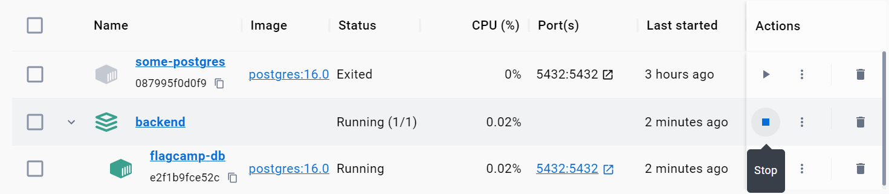
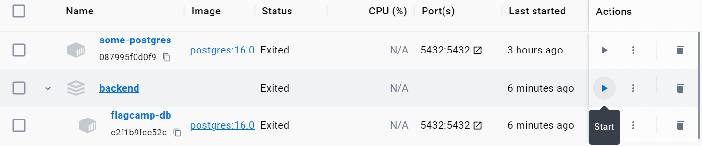

# Start with the Back-End

@author: Deming Chen (陈德铭)

## PostgreSQL in Docker

Suppose you are under the `Backend` directory. To start with, initialize a PostgreSQL container in docker:

```bash
 docker-compose up
```

This command reads `docker-compose.yml` and does a handful of things, such as pulling the docker image (if it does not exist), creating a container and running it. For details, see [this guide](./docker.md). It occupies a terminal window, so you could open a new one. Also, you could just press `ctrl+C` to stop the container. Pressing `ctrl+C` has the same effect as click `Stop` in docker desktop. 

Afterwards, you are able to restart it by click `Start` in docker desktop or run this command again.

## Connecting to PostgreSQL Database using Go

In the starting code, we connect to PostgreSQL database using Go. We need to install the `pq` package using go package manager:

```bash
go get github.com/lib/pq
```

Here, we have initialize a module called `secondHand`. Now, change your directory to it. To test connection, run

```bash
go run main.go
```

You are expected to see

```
started-service
Connected to PostgreSQL database successfully!
Initialized PostgreSQL database successfully!
```

